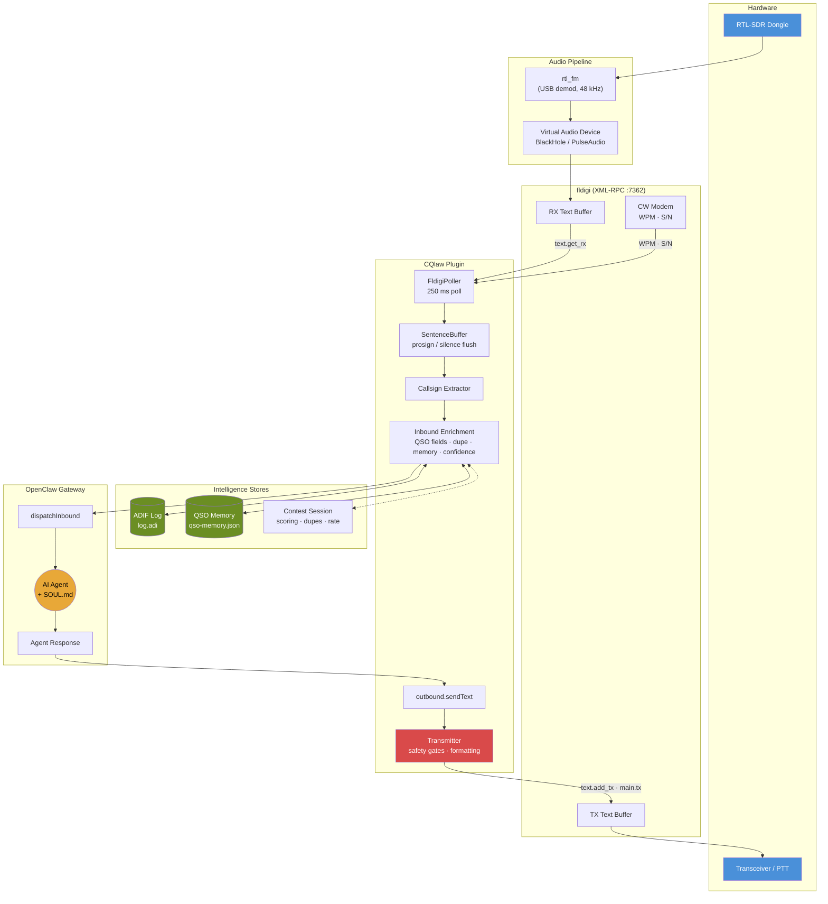
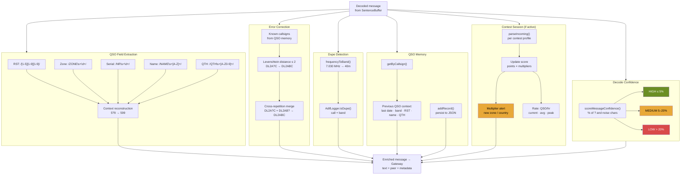

# CQlaw

OpenClaw channel plugin for CW/Morse code via SDR radio and fldigi.

CQ is the universal "calling all stations" signal that opens every contact on the air. And "claw" is right there in the letters. Clean, immediately readable, references both the OpenClaw ecosystem and the most fundamental CW operation.

## Prerequisites

- [Node.js](https://nodejs.org/) v22+
- [fldigi](http://www.w1hkj.com/) (for Phase 2+)
- [RTL-SDR](https://www.rtl-sdr.com/) dongle + `librtlsdr` (for Phase 3+)

## Installation

```bash
npm install
```

Install as an OpenClaw plugin:

```bash
openclaw plugins install -l .
```

## Configuration

The plugin reads its configuration from the `openclaw.json` channel config. All fields have sensible defaults — only override what you need.

| Field | Type | Default | Description |
|-------|------|---------|-------------|
| `frequency` | number | `7030000` | Frequency in Hz (7.030 MHz = 40m CW) |
| `mode` | string | `"CW"` | Operating mode |
| `fldigi.host` | string | `"127.0.0.1"` | fldigi XML-RPC host |
| `fldigi.port` | number | `7362` | fldigi XML-RPC port |
| `fldigi.pollingIntervalMs` | number | `250` | How often to poll fldigi for decoded text |
| `sdr.enabled` | boolean | `false` | Enable RTL-SDR audio pipeline |
| `sdr.device` | string | `""` | RTL-SDR device identifier |
| `sdr.sampleRate` | number | `48000` | Audio sample rate |
| `tx.enabled` | boolean | `false` | Enable transmission (requires license!) |
| `tx.inhibit` | boolean | `false` | Emergency TX kill switch |
| `tx.maxDurationSeconds` | number | `120` | Safety limit for max TX duration |
| `tx.wpm` | number | `20` | Default transmit speed (words per minute) |
| `tx.callsign` | string | `""` | Station callsign (required for TX) |
| `tx.pttMethod` | string | `"none"` | PTT method: `"cat"`, `"vox"`, `"serial"`, `"none"` |
| `qrz.username` | string | `""` | QRZ XML API username (optional, for callsign enrichment) |
| `qrz.password` | string | `""` | QRZ XML API password or key (optional, can be provided via env var) |
| `callsignLookup.enabled` | boolean | `true` | Enable callsign enrichment lookups |
| `callsignLookup.provider` | string | `"mock"` | Lookup provider: `"mock"`, `"qrz"`, `"hamdb"`, `"callook"`, `"hamqth"`, `"auto"` |
| `callsignLookup.cacheTtlSeconds` | number | `86400` | Lookup cache TTL in seconds |

Environment variable overrides (useful for secrets and deployment):

- `CQLAW_TX_CALLSIGN` (or `OPENCLAW_TX_CALLSIGN`)
- `CQLAW_QRZ_USERNAME`
- `CQLAW_QRZ_PASSWORD`
- `CQLAW_FREQUENCY`, `CQLAW_MODE`
- `CQLAW_FLDIGI_HOST`, `CQLAW_FLDIGI_PORT`, `CQLAW_FLDIGI_POLLING_INTERVAL_MS`
- `CQLAW_SDR_ENABLED`, `CQLAW_SDR_DEVICE`, `CQLAW_SDR_SAMPLE_RATE`
- `CQLAW_TX_ENABLED`, `CQLAW_TX_INHIBIT`, `CQLAW_TX_MAX_DURATION_SECONDS`, `CQLAW_TX_WPM`, `CQLAW_TX_PTT_METHOD`
- `CQLAW_CALLSIGN_LOOKUP_ENABLED`, `CQLAW_CALLSIGN_LOOKUP_PROVIDER`, `CQLAW_CALLSIGN_LOOKUP_CACHE_TTL_SECONDS`

Callsign lookup is provider-agnostic. The default `mock` provider is intended for development and testing; production providers (QRZ/HamDB/Callook/HamQTH) can be added behind the same interface.

Current provider status:
- `mock`: implemented (deterministic local data for development/tests)
- `qrz`: interface placeholder present; XML API transport/session flow still pending
- `hamdb` / `callook` / `hamqth`: reserved provider IDs for follow-up implementations

## Development

```bash
# Type-check
npm run typecheck

# Build
npm run build

# Run tests
npm test
```

For testing with fldigi and virtual audio (no radio hardware needed), see the full **[Development Guide](docs/development.md)** — covers fldigi installation, virtual audio setup, and the WAV-to-decode pipeline.

## Architecture

### System Overview



### Receive Path (RX)

The receive pipeline transforms raw fldigi decoded output into enriched, contextual messages for the AI agent.

```mermaid
flowchart LR
    subgraph fldigi
        RXBUF[RX Buffer]
        WPM[Modem WPM]
        SNR[Modem S/N]
    end

    subgraph Polling ["FldigiPoller (every 250 ms)"]
        direction TB
        POLL["getRxLength()<br/>getRxText(offset, len)"]
        NOISE["filterDecodeNoise()<br/>strip artifacts · collapse whitespace"]
        METRICS["sample WPM + S/N<br/>(every 1 s)"]
    end

    subgraph Buffering [SentenceBuffer]
        direction TB
        ACCUM["Accumulate<br/>characters"]
        FLUSH{"Flush<br/>trigger?"}
        PROSIGN[" AR · SK · K · KN · BK "]
        SILENCE["3 s silence<br/>timeout"]
    end

    subgraph PeerID [Callsign Extraction]
        direction TB
        CQ["CQ DE &lt;call&gt;"]
        DIR["&lt;call&gt; DE &lt;call&gt;"]
        ANY["Any callsign<br/>(fallback)"]
    end

    subgraph Enrichment ["enrichInbound()"]
        direction TB
        CONF["scoreMessageConfidence()"]
        QSO["extractQsoFields()<br/>RST · zone · serial · name · QTH"]
        FUZZY["fuzzyMatchCallsign()<br/>Levenshtein vs known calls"]
        DUPE["isDupe(call, band)"]
        HIST["QSO memory lookup<br/>previous contacts"]
        TAG["Tag: DUPE · LOW-CONFIDENCE"]
    end

    DISPATCH["api.dispatchInbound()<br/>text + peer + metadata"]

    RXBUF --> POLL --> NOISE --> ACCUM
    WPM --> METRICS
    SNR --> METRICS
    ACCUM --> FLUSH
    FLUSH -- "prosign detected" --> PROSIGN --> PeerID
    FLUSH -- "silence elapsed" --> SILENCE --> PeerID
    CQ --> Enrichment
    DIR --> Enrichment
    ANY --> Enrichment
    CONF --> QSO --> FUZZY --> DUPE --> HIST --> TAG --> DISPATCH
```



### Transmit Path (TX)

Every transmission passes through hard-coded safety gates that **cannot** be overridden by the LLM. Regulatory constraints (legal ID, speed matching, QRL?) are enforced in code, not by prompt.

```mermaid
flowchart TB
    AGENT["Agent response text"]
    STOP{"/stop-tx ?"}
    ESTOP["emergencyStop()<br/>abort + inhibit"]

    subgraph Preflight ["Preflight Checks"]
        direction TB
        EN["tx.enabled?"]
        INH["!inhibited?"]
        CALL["tx.callsign set?"]
        COOL["500 ms TX<br/>cooldown elapsed?"]
        LISTEN["10 s listen-before-<br/>transmit elapsed?"]
    end

    subgraph QRL ["QRL? Check (first TX on freq)"]
        direction TB
        SEND_QRL["Send QRL?"]
        WAIT["Listen 5 s"]
        CLEAR{"Activity<br/>detected?"}
    end

    subgraph Format ["Text Processing"]
        direction TB
        SANITIZE["sanitizeForCw()<br/>uppercase · strip invalid"]
        FMT["formatForCw(intent)<br/>CQ → K · reply → KN · signoff → SK<br/>prepend addressing"]
    end

    subgraph Speed ["Speed Matching"]
        direction TB
        RXWPM["Detected RX WPM"]
        MATCH["TX WPM ≤ RX WPM<br/>(hard constraint)"]
        DEFAULT["Fallback: config.tx.wpm"]
    end

    subgraph Legal ["Legal Identification"]
        direction TB
        TIMER{"≥ 10 min since<br/>last ID?"}
        APPEND["Append DE &lt;callsign&gt;"]
    end

    subgraph Transmit ["Transmit + Monitor"]
        direction TB
        FLDIGI["sendTxText() → startTx()"]
        MAXDUR["Max duration timer<br/>(default 120 s)"]
        POLL_TX["Poll TX buffer<br/>every 500 ms"]
        DONE["TX complete"]
    end

    LOG["Log: timestamp · text · WPM<br/>duration · frequency · callsign"]

    AGENT --> STOP
    STOP -- "yes" --> ESTOP
    STOP -- "no" --> Preflight
    EN -- "no" --> REJECT1["Reject: TX disabled"]
    INH -- "no" --> REJECT2["Reject: inhibited"]
    CALL -- "no" --> REJECT3["Reject: no callsign"]
    EN -- "yes" --> INH -- "yes" --> CALL -- "yes" --> COOL --> LISTEN --> QRL
    SEND_QRL --> WAIT --> CLEAR
    CLEAR -- "yes" --> REJECT4["Reject: freq occupied"]
    CLEAR -- "no" --> Format
    SANITIZE --> FMT --> Speed
    RXWPM --> MATCH
    MATCH --> Legal
    DEFAULT -.-> MATCH
    TIMER -- "yes" --> APPEND --> Transmit
    TIMER -- "no" --> Transmit
    FLDIGI --> MAXDUR
    FLDIGI --> POLL_TX --> DONE --> LOG

    style ESTOP fill:#d94a4a,color:#fff
    style REJECT1 fill:#d94a4a,color:#fff
    style REJECT2 fill:#d94a4a,color:#fff
    style REJECT3 fill:#d94a4a,color:#fff
    style REJECT4 fill:#d94a4a,color:#fff
    style MATCH fill:#e8a838,color:#000
    style APPEND fill:#e8a838,color:#000
    style LOG fill:#6b8e23,color:#fff
```



### Intelligence & Enrichment Pipeline



### Contest Operation Flow

```mermaid
flowchart LR
    subgraph Profiles ["Contest Profiles"]
        CQWW["CQWW<br/>RST + CQ zone"]
        WPX["CQ-WPX<br/>RST + serial"]
        FD["ARRL-FD<br/>category + section"]
        SS["ARRL-SS<br/>ser + prec + call + check + sect"]
        IARU["IARU-HF<br/>RST + ITU zone"]
    end

    ACT["activate(contestId)"]

    subgraph Session ["Contest Session"]
        CLOCK["Contest clock<br/>elapsed / remaining"]
        SERIAL["Serial counter<br/>auto-increment"]
        DUPE_SHEET["Dupe sheet<br/>per band"]
    end

    subgraph Scoring
        PTS["QSO points<br/>same continent: 1<br/>diff continent: 3"]
        MULTS["Multipliers<br/>countries · zones · prefixes<br/>per band"]
        TOTAL["Total = pts × mults"]
        RATE_M["Rate metrics<br/>QSO/hr · projected score"]
    end

    subgraph Export
        ADIF_E["ADIF log"]
        CAB["Cabrillo export<br/>contest submission"]
    end

    Profiles --> ACT --> Session
    Session --> Scoring
    PTS --> TOTAL
    MULTS --> TOTAL
    Session --> Export
    Scoring --> Export

    style TOTAL fill:#e8a838,color:#000
    style CAB fill:#6b8e23,color:#fff
```



## Project Structure

```
src/
  index.ts            — Plugin entry point, registers channel and service
  config.ts           — Channel configuration schema, defaults, validation
  openclaw-api.ts     — OpenClaw Gateway API type definitions
  outbound.ts         — Outbound message handler (wired TX path via Transmitter)
  service.ts          — Background service (fldigi polling + inbound enrichment)
  xmlrpc.ts           — Zero-dependency XML-RPC client (Node built-in http)
  fldigi-client.ts    — Typed wrapper for fldigi's XML-RPC API
  fldigi-poller.ts    — Polling loop: fldigi → SentenceBuffer → callsign → dispatch
  sentence-buffer.ts  — Accumulates decoded CW, flushes on prosign or silence
  callsign.ts         — Amateur radio callsign pattern extraction
  callsign-lookup.ts  — Provider-agnostic lookup service (mock provider + provider interface)
scripts/
  play-wav-to-fldigi.sh — Play a WAV into fldigi via virtual audio, show decoded text
docs/
  development.md      — Full dev setup guide (fldigi, virtual audio, testing workflow)
```

## License

ISC
